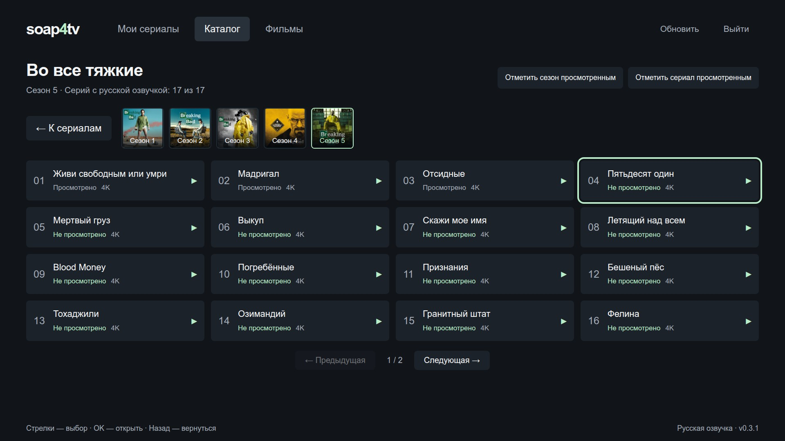

# Soap4Samsung

Минимальный открытый клиент Soap4me для Samsung Smart TV на Tizen: каталог,
«Мои сериалы», фильмы и просмотр через системный плеер AVPlay. Без фреймворков
и внешних JavaScript-зависимостей. После установки компьютер для просмотра не нужен.

Проект сделан на чистом энтузиазме: хотелось удобно смотреть любимый сервис
на своём телевизоре. На нашем Samsung Soap4me во встроенном браузере работал
плохо, особенно после обновления — так и появился этот клиент. С уважением
к командам Soap4me и Samsung, без намерения кого-либо задеть; это неофициальное
приложение, не связанное с этими компаниями.

**Каталог**


**Сезон и серии**



Скриншоты настоящего интерфейса в локальном превью на демонстрационных данных,
без данных аккаунта. Подборка, статусы просмотра и отметки качества показаны для примера.

**Установка только кажется сложной:** инструкция длинная, потому что подробно
описывает первую настройку SDK и сертификатов. Можно отдать репозиторий
современному AI-агенту с доступом к вашему компьютеру и попросить помочь
с подготовкой, сборкой и установкой. Например, начать с
[OpenCode](https://opencode.ai) — у него есть
[бесплатные модели](https://opencode.ai/docs/zen/).
Результат зависит от модели и окружения; вход в Samsung, пароли сертификатов
и включение Developer Mode на ТВ потребуют вашего участия.

<details>
<summary>Пример задания для AI-агента</summary>

> Помоги собрать и установить https://github.com/xmatic-squad/soap4samsung
> на мой Samsung Tizen. Прочитай README.md и AGENTS.md, проверь окружение,
> подготовь инструменты, выполни проверки и сборку. Проведи меня через создание
> собственных сертификатов Samsung, подключение телевизора и установку.
> Пароли и ключи не запрашивай в чате и не записывай в репозиторий:
> пароли сертификатов введу в локальном окне, а в Soap4me войду на телевизоре.

</details>

Это независимый проект. Нужны собственный аккаунт Soap4me и доступ к выбранному
контенту в сервисе. Вход выполняется **на телевизоре**: логин и пароль не надо
добавлять в исходники, настройки сборки или GitHub. Каждый пользователь создаёт
**свои сертификаты Samsung** для своего телевизора и сам подписывает приложение.

Проверено на **Samsung QE55Q70TAUXRU, Tizen 5.5, Chromium 69**. В манифесте
указан минимум Tizen 5.5; совместимость остальных моделей ещё нужно проверять.
На старые Samsung с платформой Orsay этот пакет не рассчитан.

## Что умеет

- «Мои сериалы», общий каталог и фильмы с поиском по словам русского и оригинального названия.
- Своя русская/английская клавиатура поиска: открывается по OK или клику,
  «Найти» применяет запрос, Back отменяет ввод. Простое наведение её не открывает.
- Статусы просмотренных серий из сервиса, отметка всего сериала или сезона просмотренным.
- Рейтинги IMDb, Кинопоиска и Soap4me на обложках, когда они есть в каталоге сервиса.
- Меню сортировки по названию, году или одному из рейтингов, с сохранением выбора
  для каждого раздела. В «Моих» по умолчанию сначала непросмотренные, в фильмах — новые по году.
- Квадратные обложки целиком, изображения сезонов, 4 колонки серий на ТВ.
- Русская озвучка и максимальное доступное качество: **4K → Full HD → 720p → SD**.
  Для фильмов выбирается совместимый AVC/H.264 до 4K с русским звуком без субтитров.
- Небольшой индикатор фактического разрешения: исчезает с панелью управления,
  остаётся видимым на паузе.
- Пауза и управление пультом. Стрелки перематывают на 10 секунд; при удержании
  шаг постепенно растёт до 30 секунд, минуты, двух и пяти минут.
- Следующая серия запускается после естественного окончания предыдущей в пределах
  сезона. Последняя возвращает к списку. После фильма открывается его карточка.
- Вход сохраняется между запусками. Пароль приложение не хранит.

Доступное качество зависит от материалов сервиса, аккаунта и телевизора.
Прогресс и статус просмотра автоматически на сервер пока не записываются;
массовые кнопки «Просмотреть всё» меняют данные аккаунта. Добавление сериалов
в «Мои» выполняется на сайте. Оригинальная озвучка и субтитры пока не поддерживаются.

## Самостоятельная установка

Первый раз нужно подготовить SDK, подключить ТВ и создать подпись.
При следующих обновлениях достаточно получить исходники, собрать и установить пакет.
Команды ниже предназначены для **Bash на Linux**, где проверен цикл разработки.
На Windows и macOS команды и пути SDK потребуют адаптации; полный цикл проекта
на этих системах пока не проверен.

### 1. Подготовить компьютер

Потребуются:

- Git, Node.js 22 или новее с npm, Python 3.9 или новее.
- [Tizen Studio](https://developer.samsung.com/smarttv/develop/tools/tizen-studio.html),
  инструменты Web/CLI и SDB.
- **Samsung TV Extensions**, **Certificate Manager** и **Samsung Certificate Extension**.
- Собственный [Samsung Developer account](https://developer.samsung.com).
- Компьютер и включённый телевизор в одной локальной сети.

Установите SDK по [инструкции Samsung](https://developer.samsung.com/smarttv/develop/getting-started/setting-up-sdk/installing-tv-sdk.html).
В Package Manager откройте **Extension SDK** и установите TV Extensions и Samsung
Certificate Extension. Для создания сертификатов после сентября 2025 года Samsung
требует Certificate Extension **2.0.73 или новее**; используйте актуальную версию.
Требования SDK к ОС и системным пакетам указаны в
[Samsung Prerequisites](https://developer.samsung.com/smarttv/develop/tools/prerequisites.html).
Эмулятор для установки на собственный ТВ не нужен.

Склонируйте исходники и проверьте сборку:

```sh
git clone https://github.com/xmatic-squad/soap4samsung.git
cd soap4samsung
node --version
python3 --version
npm test
npm run build
```

У проекта нет npm-зависимостей: `npm install` не требуется.
Пока получится `.local/Soap4Samsung-unsigned.wgt` — пакет без подписи для проверки
сборки. Для установки нужен подписанный вариант из шага 5.

### 2. Включить Developer Mode на ТВ

1. Узнайте **локальный IPv4 компьютера** и отдельно **IP телевизора**
   в настройках сети ТВ или в списке устройств роутера.
2. Откройте Smart Hub → **Apps → App Settings** и наберите **12345**
   пультом или экранной цифровой клавиатурой. На некоторых версиях интерфейса
   комбинация вводится прямо в разделе Apps.
3. Включите **Developer Mode: On**. В **Host PC IP** укажите адрес компьютера,
   с которого будете устанавливать приложение.
4. Подтвердите и полностью перезапустите телевизор. Проверьте, что режим сохранился.

Например, если компьютер имеет адрес `192.168.1.10`, а ТВ — `192.168.1.20`,
в **Host PC IP нужен `192.168.1.10`**. Это только примеры — используйте свои адреса.
При изменении адреса компьютера обновите Host PC IP и перезапустите ТВ.
[Официальные шаги подключения](https://developer.samsung.com/smarttv/develop/getting-started/using-sdk/tv-device.html).

### 3. Подключиться через SDB

Укажите путь, который выбрали при установке SDK, и IP своего ТВ:

```sh
soap_sdk="$HOME/tizen-studio"
soap_tv_ip="192.168.1.20"
soap_tv="$soap_tv_ip:26101"
soap_sdb="$soap_sdk/tools/sdb"
soap_tizen="$soap_sdk/tools/ide/bin/tizen"

"$soap_sdb" connect "$soap_tv"
"$soap_sdb" devices
```

Адрес `192.168.1.20` здесь также пример. Телевизор должен появиться со статусом
`device`. В последнем столбце будет имя устройства для параметра `-t` Tizen CLI.
Скопируйте **имя своего устройства**:

```sh
soap_target="ИМЯ_УСТРОЙСТВА_ИЗ_SDB_DEVICES"
```

Эти переменные действуют в текущем терминале. Паролей среди них нет.
Для сохранения локальных параметров есть [`.env.example`](.env.example):
скопируйте его в игнорируемый `.env` и задайте свои значения. Приложение
не читает этот файл; пример загрузки переменных описан в
[документации разработки](docs/DEVELOPMENT.md).
Телевизор можно также добавить через Tizen Studio → Tools → Device Manager →
Remote Device Manager, указав его адрес и порт `26101`.

### 4. Создать собственную подпись Samsung

В Tizen Studio откройте **Tools → Certificate Manager**:

1. `+` → **Samsung → TV**. Назовите профиль `Soap4Samsung`.
2. Создайте **новый author certificate**, заполните сведения об авторе,
   задайте собственный пароль сертификата и войдите в свой Samsung-аккаунт.
3. Создайте **distributor certificate** с уровнем **Public** и добавьте
   **DUID своего телевизора** из списка подключённых устройств.
4. Завершите мастер и сохраните профиль активным.

Здесь Public — уровень сертификата для установки на устройство, а не публикация
в магазине. Нужен именно Samsung distributor с DUID вашего ТВ, а не
`SDK default distributor certificate`. Пароли вводятся в локальном окне Samsung.
Сертификаты не выдаются этим репозиторием и не должны в него загружаться.
Подробности, исправление ошибочного профиля и резервная копия:
[docs/CERTIFICATES.md](docs/CERTIFICATES.md).

### 5. Подписать, установить и запустить

Из корня проекта, с переменными из шага 3:

```sh
python3 tools/package.py --profile Soap4Samsung --tizen "$soap_tizen"
"$soap_tizen" install -n Soap4Samsung.wgt -t "$soap_target" -- .local
"$soap_tizen" run -p Soap4TV001.Soap4Samsung -t "$soap_target"
```

Дождитесь успешного результата каждой команды, прежде чем выполнять следующую.
Подписанный пакет находится в `.local/Soap4Samsung.wgt`.
Откройте Soap4Samsung на телевизоре и **введите там свой логин и пароль Soap4me**.
После успешного входа должны загрузиться «Мои сериалы» и каталог.

Готовый чужой `.wgt` не заменяет вашу подпись: для установки на ваш ТВ его DUID
должен входить в distributor certificate. Сборщик включает только ресурсы приложения
и публичный номер версии; учётные данные в пакет не встраиваются.

## Как обновить приложение

Сохраните тот же **author certificate**, app ID `Soap4TV001.Soap4Samsung`
и package ID `Soap4TV001`. В чистой копии проекта получите изменения, затем
повторите настройку переменных из шага 3, если открыли новый терминал:

```sh
git pull --ff-only
npm test
npm run build
python3 tools/package.py --profile Soap4Samsung --tizen "$soap_tizen"
"$soap_sdb" -s "$soap_tv" shell 0 was_kill Soap4TV001.Soap4Samsung
"$soap_tizen" install -n Soap4Samsung.wgt -t "$soap_target" -- .local
"$soap_tizen" run -p Soap4TV001.Soap4Samsung -t "$soap_target"
```

Если приложение уже закрыто, `was_kill` может сообщить об отсутствии процесса.
При ошибке подписи или установки сначала исправьте её. **Не удаляйте приложение
для обычного обновления:** установка поверх с прежним author сохраняет вход
и локальные настройки. После запуска проверьте версию внизу экрана.

Если правили код сами, перед `git pull` сохраните изменения в отдельной ветке.
Как дорабатывать приложение и проверять его на ТВ:
[docs/DEVELOPMENT.md](docs/DEVELOPMENT.md).

## Проверка интерфейса без телевизора

```sh
npm run preview
```

Откройте `http://127.0.0.1:8765`. Сервер слушает только этот компьютер;
останавливается через Ctrl+C. Можно проверить навигацию стрелками, Enter и Escape,
поиск, карточки и вход через экран приложения. Не записывайте аккаунт в файлы.

Preview использует HTML5-видео. Обычный Chrome без дополнительного HLS-плеера
не воспроизводит фильмы этого сервиса: воспроизведение и перемотку нужно проверять
на ТВ через AVPlay. Сервер preview не входит в `.wgt`.

## Если не получилось

| Симптом | Что проверить |
|---|---|
| SDB не подключается, порт 26101 отклоняет соединение | ТВ включён, оба устройства в одной сети, Developer Mode включён, Host PC IP — текущий адрес компьютера; после изменения был перезапуск |
| В Certificate Manager нет Samsung | Установлены Samsung Certificate Extension и TV Extensions |
| В профиле стоит `tizen-distributor-signer` | Пересоздать Samsung distributor, добавив DUID своего ТВ; существующий author сохранить |
| Ошибка сертификата или установки | Правильный профиль, срок его действия, DUID нужного ТВ; при обновлении прежний author |
| Не найден `tizen` | Исправить `soap_sdk` и передать полный путь через `--tizen` |
| Пустой каталог или ошибка входа | Доступ ТВ к сервису и зеркалу, правильность аккаунта; по умолчанию используется `api.soap4youand.me` |
| Сериалы работают, фильм просит войти снова | Повторить вход на ТВ: сайту для фильмов нужна отдельная сессия |
| Фильм не показывает 4K | Проверить доступное качество сервиса и тариф; приложение показывает фактическое разрешение, а для фильмов выбирает AVC/H.264 |

Если проблему не удалось решить, создайте
[issue](https://github.com/xmatic-squad/soap4samsung/issues) с моделью ТВ,
версией приложения, шагами и текстом ошибки. **Не прикладывайте пароли, токены,
cookies, сертификаты, DUID, полные видеоссылки или снимки полей входа.**

## Документация и участие

- [Разработка, сборка, обновление и отладка](docs/DEVELOPMENT.md).
- [Собственные сертификаты и их резервная копия](docs/CERTIFICATES.md).
- [Наблюдаемый API и воспроизведение](docs/API.md).
- [Как предложить изменение](CONTRIBUTING.md).
- [Правила работы с кодом](AGENTS.md).
- [Лицензия исходного кода MIT](LICENSE).

Issues и pull requests открыты для сообщества. Изменения принимает команда
поддержки проекта после проверки; правила процесса описаны в CONTRIBUTING.

Спасибо авторам [Soap4me/Kodi](https://github.com/Soap4me/Kodi): его исходники
помогли разобраться с HTTP API сервиса. Плагин распространяется под
[LGPL v3](https://github.com/Soap4me/Kodi/blob/571d6125a1a7473427f223de77c7efa08d378a1a/LICENSE).
Soap4Samsung — отдельная реализация клиента и плеера под [MIT](LICENSE);
наша лицензия не меняет лицензию Kodi-плагина. Клиент и MD5-реализация написаны
самостоятельно.
